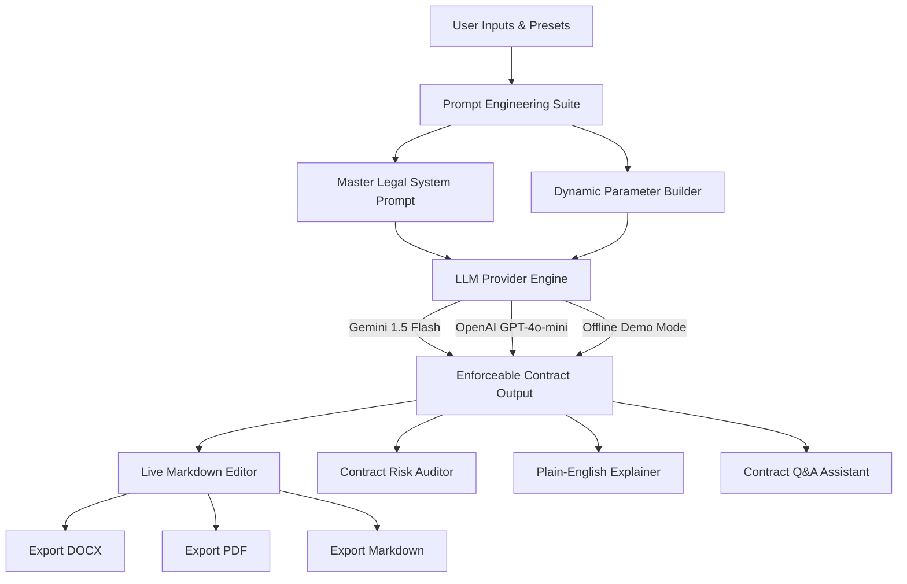

# ⚖️ LegalEase: AI-Powered Legal Document Generator & Risk Auditor

[](https://www.python.org/)
[](https://streamlit.io/)
[](https://ai.google.dev/)
[](https://openai.com/)
[](LICENSE)

**LegalEase** is an intelligent legal engineering, contract drafting, and risk auditing platform. It generates standardized, enforceable commercial agreements tailored to specific jurisdictions, customizable bargaining stances, and covenants—with instant export to Microsoft Word (`.docx`), PDF, and Markdown.

---

## 🌟 Key Features

- 📜 **Multi-Document Generation**:
  - Mutual & Unilateral NDAs
  - Independent Contractor Agreements
  - Software Development & IP Assignment Contracts
  - Employment Agreements & Offer Letters
  - Commercial Real Estate Leases
  - Website Terms of Service & Privacy Policies (GDPR / CCPA compliant)
  - Cease and Desist Notices
- 🌐 **Multi-Jurisdiction Awareness**: Adapts choice-of-law and dispute venue clauses to any state or country (e.g., California, Delaware, New York, UK, India).
- ⚖️ **Contract Bias Control**: Choose between *Balanced & Mutual*, *Favorable to Party 1*, or *Favorable to Party 2*.
- 🔍 **Contract Risk Auditor**: Paste existing agreements to detect liability traps, uncapped indemnities, one-sided covenants, and receive actionable line-by-line redlines.
- 💡 **Plain-English Explainer**: Translates dense legal jargon into an 8th-grade reading level TL;DR with key rights and gotchas.
- ❓ **Interactive Contract Q&A**: Chat directly with any contract to clarify termination rules, non-competes, and liabilities.
- ⚡ **Offline Demo Mode**: Test the complete UI, preview agreements, and download DOCX/PDF files without needing an API key!
- 💾 **Multi-Format Export**: One-click export to **Microsoft Word (`.docx`)**, **PDF**, and **Markdown**.

---

## 🏗️ Architecture & Workflow



---

## 📜 The Core AI Prompts

LegalEase relies on strict, structured prompt engineering to avoid legal hallucinations and ensure enforceable drafting:

### 1. Master System Prompt
```markdown
You are LegalEase, an elite legal engineering and contract drafting AI with deep expertise in contract law, commercial transactions, corporate governance, and risk mitigation across common law and civil law jurisdictions.

Your objectives:
1. Precision & Enforceability: Follow standard contract architecture (Preamble, Recitals, Definitions, Operative Covenants, Representations & Warranties, Indemnification, Term & Termination, Boilerplate, Signature Blocks).
2. Professional Tone: Authoritative, modern legal phrasing without archaic legalese.
3. Jurisdiction Awareness: Tailor statutory references and choice-of-law to user jurisdiction.
4. Bias Calibration: Precisely reflect requested posture (Balanced, Party 1 Favorable, or Party 2 Favorable).
5. Mandatory Disclaimer: Append the LegalEase AI legal disclaimer at the end.
```

### 2. Contract Risk Auditor Prompt
```markdown
You are the LegalEase Senior Contract Auditor. Analyze the provided agreement and structure your response:
1. Executive Overview & Deal Summary
2. Comprehensive Risk Assessment (Rating: LOW | MEDIUM | HIGH | CRITICAL)
3. Unfavorable, High-Risk, or Ambiguous Clauses (with severity tags)
4. Missing Standard Protective Provisions
5. Actionable Redline Recommendations ("Current" vs "Proposed Redline" + Rationale)
```

---

## 🚀 Quickstart & Installation

### 1. Clone the Repository
```bash
git clone https://github.com/<your-username>/LegalEase.git
cd LegalEase
```

### 2. Set Up Virtual Environment
```bash
# Windows:
python -m venv venv
venv\Scripts\activate

# macOS / Linux:
python3 -m venv venv
source venv/bin/activate
```

### 3. Install Required Dependencies
```bash
pip install -r requirements.txt
```

### 4. Configure Environment Variables (Optional)
Copy `.env.example` to `.env`:
```bash
cp .env.example .env
```
Add your API key (or use the built-in **Demo Mode** in the app):
```env
GEMINI_API_KEY=your_gemini_api_key_here
OPENAI_API_KEY=your_openai_api_key_here
```

### 5. Launch the Application
```bash
streamlit run app.py
```
Open your browser at `http://localhost:8501`.

---

## 📁 Project Structure

```text
LegalEase/
├── app.py               # Streamlit interactive UI application
├── requirements.txt     # Python project dependencies
├── .env.example         # Template for environment variables
├── .gitignore           # Git ignore configurations
├── LICENSE              # MIT License
├── README.md            # Project documentation and guide
└── src/
    ├── __init__.py      # Package initialization
    ├── prompts.py       # Master system prompts and prompt engineering suite
    ├── generator.py     # Multi-LLM provider abstraction (Gemini / OpenAI / Demo)
    ├── presets.py       # Quick-fill sample contract presets
    └── exporter.py      # Word (.docx) and PDF export engine
```

---

## 🚢 How to Push This Project to GitHub

Follow these steps in your terminal to publish this repository to your GitHub profile:

1. **Initialize Git repository**:
   ```bash
   git init
   ```
2. **Add all files and create initial commit**:
   ```bash
   git add .
   git commit -m "feat: Initial commit for LegalEase AI legal document generator"
   ```
3. **Create a new repository on GitHub**:
   - Go to [GitHub New Repository](https://github.com/new).
   - Set repository name: `LegalEase` (or `ai-legal-document-generator`).
   - Leave "Initialize with README" **unchecked** (we already have one).
4. **Link and push to GitHub**:
   ```bash
   git branch -M main
   git remote add origin https://github.com/<your-username>/LegalEase.git
   git push -u origin main
   ```

---

## ⚠️ Legal Disclaimer

*LegalEase is an assistive software tool powered by artificial intelligence. It does NOT constitute formal legal advice, does NOT form an attorney-client relationship, and is NOT a substitute for a licensed attorney. Always have an attorney licensed in your relevant jurisdiction review agreements prior to execution.*

---

## 📄 License

This project is licensed under the [MIT License](LICENSE).
